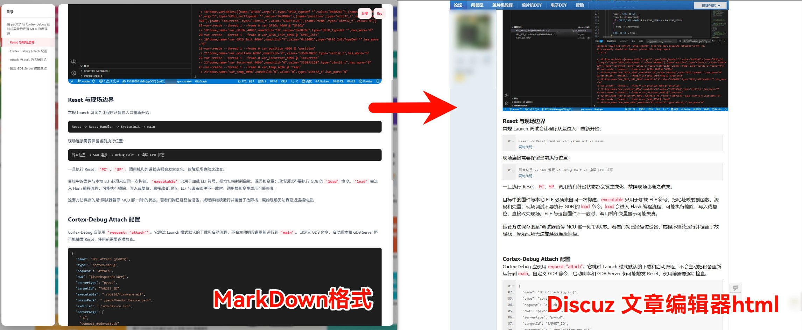

# md2html

Markdown → 纯 HTML，直接贴进 Discuz! 论坛编辑器。



## 快速开始

```bash
pip install markdown
python md2html.py article.md                      # 基础转换
python md2html.py article.md --strip-front        # 去掉 YAML 头
python md2html.py README.md -o example/README.html # 本项目自举示例
```

## 选项

| 参数 | 作用 |
|------|------|
| `-o, --output` | 输出路径（默认同名 `.html`） |
| `--strip-front` | 去掉 `---` YAML front matter |
| `--body-only` | 只输出 body 内容 |
| `--code-separator` | 代码块用 `----` 分隔符模式 |

## 输出规则

**标题**：`h1` → `<b><font size="5">`，`h2` → `size="4"`，每级递减。首个标题无前缀，后续标题前插 2 个 `<br>`。

**代码块**（默认模式）：

```html
<div class="blockcode">
<blockquote>保留缩进的代码</blockquote>
</div>
```

`--code-separator` 模式用 80 字符 `-` 分隔线包裹。

**行内代码**：粉底红字。

**表格**：`thead`/`tbody` 合并，`th` 自动 `<b>` 加粗。

**段落**：`</p>` 后插入 `<br>`；代码块前移除 `<br>`。

**时间戳**：文末自动附加 `build DD Month YYYY HH:MM (UTC+8)`。

**BBCode 兼容**：`[` `]` 用零宽空格打断，防止 Discuz! 误解析。

## 依赖

- Python 3.9+
- [Python-Markdown](https://python-markdown.github.io/) ≥ 3.0
